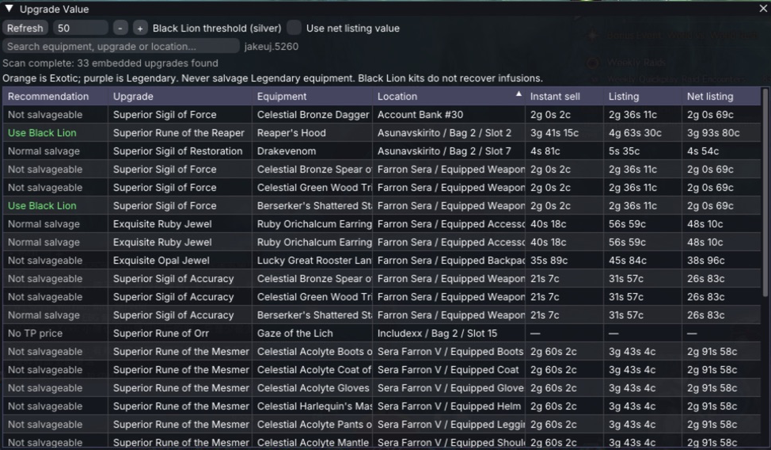
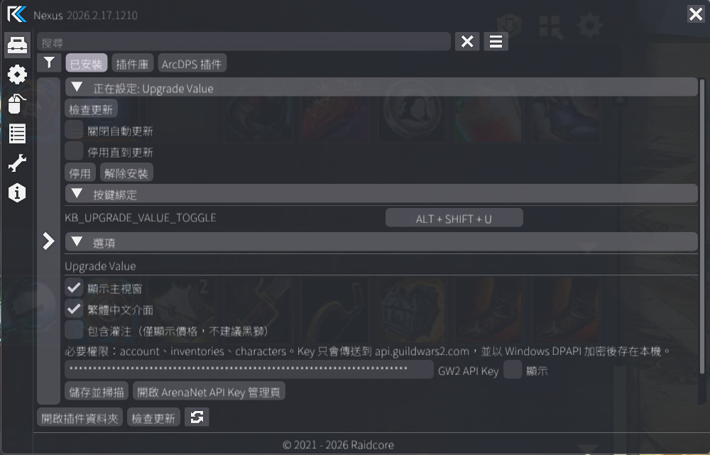

# Upgrade Value — GW2 Nexus Addon

[English](README.md) · **繁體中文**

[](https://github.com/jakeuj/GW2-Nexus-Upgrade-Value/actions/workflows/build-and-release.yml)
[](https://github.com/jakeuj/GW2-Nexus-Upgrade-Value/releases/latest)

在遊戲內掃描帳號中的橘色裝備（`Exotic`），列出內嵌的符文、印記與即時 Trading Post 價格，用來判斷是否值得消耗黑獅分解工具。

目前正式版：[**v1.0.3**](https://github.com/jakeuj/GW2-Nexus-Upgrade-Value/releases/tag/v1.0.3)

專案網站：[gw2-value.jakeuj.com](https://gw2-value.jakeuj.com/)

## Nexus 提交審核

提供 Raidcore Nexus 官方人員審核的完整資料，請參閱 [Nexus 提交審核說明](NEXUS_REVIEW.zh-Hant.md)。

簡要說明：本專案不含逆向工程程式碼、私有的第一方元件、遊戲記憶體存取或遊戲操作自動化。Guild Wars 2 資料只透過官方 v2 API 讀取，遊戲內整合僅使用公開的 Nexus API。審核說明已列出完整的 API、網路、儲存、生命週期與 ToS 相關範圍，供審核人員直接查驗。

Codex 曾協助專案文件與開發審查。此項協助會依 Raidcore 的 **AI Notice** 類別主動揭露；外掛的審查、測試、維護與提交責任仍由開發者承擔。

> [!NOTE]
> 此技術說明僅用於協助審核，不代表 ArenaNet 核准，也不取代 Nexus 審核人員最終的 ToS 判定。

## 下載

- [直接下載 `UpgradeValue.dll`](https://github.com/jakeuj/GW2-Nexus-Upgrade-Value/releases/latest/download/UpgradeValue.dll)
- [下載 `UpgradeValue-v1.0.3.zip`](https://github.com/jakeuj/GW2-Nexus-Upgrade-Value/releases/download/v1.0.3/UpgradeValue-v1.0.3.zip)
- [查看所有版本與更新內容](https://github.com/jakeuj/GW2-Nexus-Upgrade-Value/releases)

> [!IMPORTANT]
> 將 `UpgradeValue.dll` 放在 Guild Wars 2 的 `addons` 根目錄；請勿放進 `addons\Nexus` 子資料夾。

> [!NOTE]
> `v1.0.3` 起支援 Nexus 透過 GitHub Releases 檢查及安裝後續版本。`v1.0.2` 或更舊版本無法自行發現這項更新，必須先手動安裝 `v1.0.3` 一次；之後是否自動更新由使用者的 Nexus 更新設定決定。

## 作者

- GitHub：[@jakeuj](https://github.com/jakeuj)
- Guild Wars 2 ID：`jakeuj.5260`
- 完整資訊：[AUTHORS.md](AUTHORS.md)

## 實際畫面

### 升級價格與分解建議



主視窗會列出內嵌升級、所在裝備與位置，以及立即賣、最低掛單和扣除 15% 交易所費用後的掛單價值。

### Nexus 設定



可在 Nexus 設定中輸入 API Key、開啟繁體中文、選擇是否顯示灌注，並調整快捷鍵。

## 功能

- 掃描帳號銀行、共享物品欄、所有角色背包及目前裝備。
- 從物品實例的 `upgrades[]` 讀取內嵌符文／印記。
- 中文模式會使用官方 API 的 `lang=zh` 名稱，再以 Windows 轉換為繁體中文；英文模式則使用官方英文名稱。
- 批次查詢官方 `/v2/commerce/prices`：
  - `立即賣`：目前最高收購價。
  - `掛單`：目前最低出售價。
  - `扣稅掛單`：扣除 15% 交易所費用後的估值。
- 可設定黑獅分解門檻，預設 50 銀。
- 清楚標示不可分解、沒有交易所價格，以及不應分解的傳奇裝備。
- 可選擇顯示灌注價格；灌注不會被黑獅分解工具取回，因此永遠不會建議用黑獅處理。
- API Key 以 Windows DPAPI 加密後才寫入本機，不以明文保存。
- 所有網路請求均在背景執行，不阻塞遊戲畫面。
- 使用 Nexus `FONT_DEFAULT` 的完整中文字形範圍，避免繁中文字被顯示成 `?`。

## 重要差異

- GW2 的橘色品質是 `Exotic（特異）`。
- `Legendary（傳奇）` 是紫色，絕對不要拿去分解。本插件會顯示警告，不會建議分解傳奇物品。
- Nexus 公開 SDK 沒有「GW2 原生物品 Tooltip hover」事件；本版在插件自己的表格與 hover tooltip 顯示價格，不使用不穩定的遊戲記憶體 Hook。

## 安裝

1. 安裝 [Raidcore Nexus](https://raidcore.gg/gw2/nexus)。
2. 從上方「下載」區取得 `UpgradeValue.dll`，或到 [最新 Release](https://github.com/jakeuj/GW2-Nexus-Upgrade-Value/releases/latest) 下載 ZIP 壓縮檔。
3. 將 DLL 複製到 GW2 的 `addons` 根目錄，例如：

   ```text
   F:\SteamLibrary\steamapps\common\Guild Wars 2\addons\UpgradeValue.dll
   ```

   請勿放進 `addons\Nexus` 子資料夾。

4. 啟動遊戲，在 Nexus 設定中找到 **Upgrade Value**。
5. 建立 GW2 API Key，至少勾選：

   - `account`
   - `inventories`
   - `characters`

6. 貼上 Key，按「儲存並掃描」。

API Key 管理頁：<https://account.arena.net/applications>

## 使用方式

1. 按 `Alt + Shift + U` 開啟或關閉主視窗。
2. 按「重新掃描」取得目前帳號裝備及最新交易所價格。
3. 設定「黑獅門檻（銀）」，預設為 50 銀。
4. 選擇用「立即賣」或「扣稅掛單價」判斷。
5. 使用搜尋欄按裝備、升級名稱或所在位置過濾結果。

建議欄可能顯示：

- `使用黑獅`：內嵌符文／印記價值達到設定門檻。
- `一般分解`：升級價值低於門檻。
- `不可分解`：物品帶有 `NoSalvage` 限制。
- `無交易所價格`：升級為帳號綁定或沒有有效掛單。
- `黑獅不取回`：灌注不會由黑獅分解工具取回。
- `絕對不要分解`：傳奇裝備安全警告。

## 建置

需求：Visual Studio 2022、Desktop development with C++、Windows 10/11 SDK。

```powershell
msbuild UpgradeValue.sln /m /p:Configuration=Release /p:Platform=x64
```

輸出檔：`bin/Release/UpgradeValue.dll`

專案已附帶建置需要的 Nexus API header、Raidcore ImGui fork 與 nlohmann/json。

## CI/CD 與發行

- [Build and release](https://github.com/jakeuj/GW2-Nexus-Upgrade-Value/actions/workflows/build-and-release.yml) 會在推送到 `main` 或建立 Pull Request 時，自動執行 Windows x64 Release 建置並上傳 Artifact。
- 推送符合 `v*` 的 tag（例如 `v1.0.3`）時，會自動建立 GitHub Release，並附上 DLL 與 ZIP。
- 也可以從 **Actions → Build and release → Run workflow** 輸入版本號手動發行；版本必須與 `src/entry.cpp` 的插件版本一致。
- GitHub Release Notes 會根據此次發行包含的 commits 自動產生。

## 資料來源與安全性

- 帳號物品：`https://api.guildwars2.com/v2/account/bank`、`/account/inventory`、`/characters?ids=all`
- 物品資料：`/v2/items?ids=...&lang=zh`
- 價格資料：`/v2/commerce/prices?ids=...`
- API Key 透過 `Authorization: Bearer` header 傳送，只連線到 `api.guildwars2.com`。

## 已知限制

- 官方 API 是帳號快照，不會在物品移動的當下主動推播；請按「重新掃描」更新。
- 目前只讀取角色目前裝備與背包，不展開每個未啟用的裝備模板。
- 建議僅依「內嵌升級的市價門檻」判定，沒有把裝備本體、球形靈質或一次黑獅工具的主觀機會成本納入精算。
- 尚未提交 Raidcore 插件庫，因此需手動放入 DLL。

## 授權

Copyright © 2026 [jakeuj](https://github.com/jakeuj)。

本專案程式碼採 MIT License。`vendor/` 內的第三方元件依各自附帶的授權條款使用。
